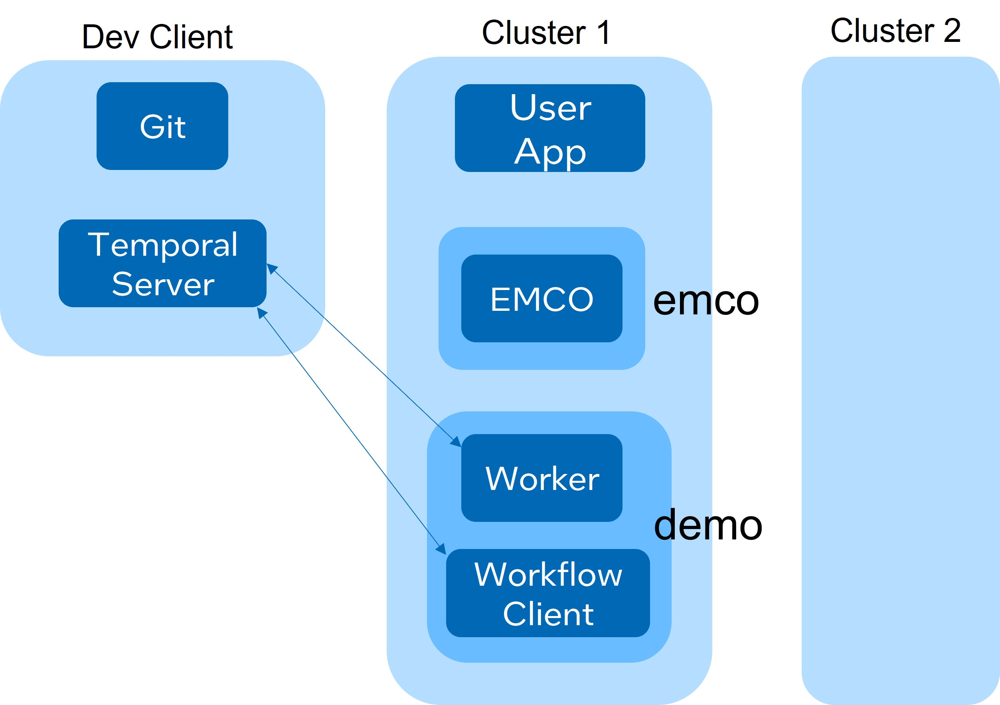

```text
SPDX-License-Identifier: Apache-2.0
Copyright (c) 2022 Intel Corporation
```
<!-- omit in toc -->
# Migrate: A Temporal Workflow in EMCO for App Migration

This document describes a reference Temporal workflow designed to be used
with EMCO. The workflow migrates a stateless application deployed by EMCO
in one cluster to another specified cluster. 

The reader is expected to be familiar with
[EMCO](https://gitlab.com/project-emco/core/emco-base) and
[Temporal](https://docs.temporal.io/docs/temporal-explained/introduction).
In particular, it is important to read the document [Temporal Workflows in
EMCO](https://gitlab.com/project-emco/core/emco-base/-/blob/emco-temporal/docs/user/Temporal_Workflows_In_EMCO.md) first.

## Introduction
The Edge Multi-Cluster Orchestrator (EMCO), an open source project in Linux
Foundation Networking, has been enhanced to launch and manage Temporal
workflows. This repository contains a reference workflow that migrates
a stateless application deployed by EMCO in one cluster to another
specified cluster. This can be taken as a template to develop workflows to
migrate stateful applications and other workflows as well.

## Reference Workflow For EMCO
The relationship among the main workflow entities is explained in the document
[Temporal Workflows in EMCO](https://gitlab.com/project-emco/core/emco-base/-/blob/emco-temporal/docs/user/Temporal_Workflows_In_EMCO.md). It is recapitulated below.

In general, a workflow is executed by a worker entity within a worker process;
there can be one or more worker entities within a worker process, and one or
more worker processes in a system. In this specific migration workflow, there
is one worker process with one worker entity, which executes one workflow
with three activities.

In general, there can be multiple workflow clients managed by EMCO. Each
client may launch many workflows, including copies of the same workflow,
with distinct workflow IDs. In the migration workflow, there is only one
workflow client and it starts only one workflow. But the source code
layout, build environment and the workflow container image can all be
extended to multiple workflow clients.

The atructure of the workflow client container can take any form: EMCO does
not mandate anything. In the migration workflow, the workflow client
container has a HTTP server that receives a `HTTP POST` call from EMCO's
`workflowmgr` microservice and executes the named workflow client binary
with the named workflow ID. This design allows for many workflow clients
to be packaged with a single HTTP server, and the `POST` call specifies
which workflow client needs to be executed.

The communication between the workers and the workflow clients can take any
form: EMCO has no specific requirements. In the migration workflow, both
the worker container and the workflow container get an environment variable
specifying the network endpoint of the Temporal Server.

## Source Code Layout
The repository includes both a workflow client and the workflow per se. 
Each of those can be conceptually divided into generic Temporal code
and workflow-specific code. The source code layout reflects those
categories. Under `src`, we have:

 * `workflowclients/`: code related to workflow client(s).
   * `http_server/`: The common HTTP server for all workflow clients.
   * `migrate_workflowclient/`: The only workflow client available now.
   * Can add more directories for other workflow clients in the future.
 * `worker/`: The worker process for migrate workflow.
 * `emcomigrate/`:  The core workflow and activities for migration.

## Demonstration Steps

The workflow can be demonstrated in action. This broadly requires deploying
the Temporal server in some location (not necessarily a Kubernetes
cluster) with the EMCO components in a Kubernetes cluster along with the
workflow client and the worker pods. Note that, since the EMCO
`workflowmgr` service calls the workflow client as a cluster-local service
name via coredns in this demo, and since the worker also calls into EMCO APIs as a cluster-local service name, they all need to be in the same Kubernetes cluster in this demo. In general, there is no such requirement though. The EMCO microservices are in `emco` namespace and the workflow client/worker are in the `demo` namespace in this demo.

The examples are tailored to the deployment layout in Figure 1. 



Figure 1 - EMCO Deployment with Temporal

The steps for deploying and using the workflow are as follows.

* Deploy EMCO.

  * `git clone https://gitlab.com/project-emco/core/emco-base.git`
  * Follow the documentation to build and deploy EMCO.

* Deploy the sample application n `samples/apps` using EMCO: see `samples/intents`.
  * `cd samples/intents` (inside this repository)
  * Customize the EMCO IP address in `emco-cfg-remote.yaml` for uoir
    deployment.
  * Run `emcoctl --config emco-cfg-remote.yaml apply` for the first 5
    templates: `00.*.yaml` through `03.*.yaml`.

* Define the workflow intent in EMCO.
  * `cd samples/intents` (inside this repository)
  * `emcoctl --config emco-cfg-remote.yaml apply -v values*.yaml -f 04.define-workflow-1.yaml`
  Note that the `04.define-workflow-1.yaml` defines a workflow intent
  in EMCO though we have not yet deployed the workflow client or worker
  yet; this is meant to show that the workflow intent definition by
  itself does not interact with temporal components.

* Build the workflow client and workflow container images.
  * `make all` (from the top directory of the repo)

* Deploy the Temporal server.
  * `git clone https://github.com/temporalio/docker-compose.git`
  * `cd temporal-docker-compose`
  * `docker-compose -f docker-compose.yml up -Vd`

* Deploy the workflow client and workflow container images.
  * `cd deployment/helm` (in this repository)
  * `helm install demo1 worker -n demo`
  * `helm install demo workflowclient -n demo`

* Run the workflow start API.
  * `cd samples/intents` (inside this repository)
  * `emcoctl --config emco-cfg-remote.yaml apply -v values*.yaml -f 05.start-workflow.yaml`

* Optionally run the status query API.
  * `cd samples/intents` (inside this repository)
  * In `06.get-workflow-status.yaml`, update the Temporal Server endpoint
    in the query parameters for your environment. Optionally customize the
    different query flags in the get URL.
  * `emcoctl --config emco-cfg-remote.yaml get -v values*.yaml -f 06.get-workflow-status.yaml`


* Optionally run the cancel API.
  * `cd samples/intents` (inside this repository)
  * In `06.get-workflow-status.yaml`, update the Temporal Server endpoint
    in the query parameters for your environment. Optionally, set
    `terminate` flag to `true` if you want to forcibly terminate a workflow
    rather than cancel it.
  * `emcoctl --config emco-cfg-remote.yaml apply -v values*.yaml -f 07.cancel-workflow.yaml`

## Resources
 * [Temporal workfow engine](https://docs.temporal.io/docs/temporal-explained/introduction)

